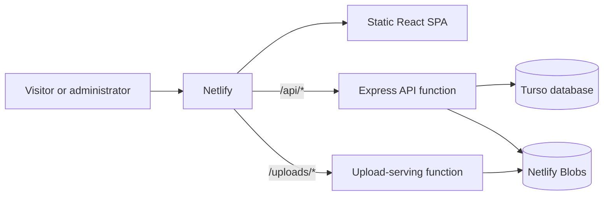

# Vlad Coșa - Cabinet Individual de Psihologie

A minimalist React website and blog for a psychology practice, deployed on Netlify with serverless API functions and managed storage.

## Architecture



- Netlify serves the Vite build from `dist/` and applies the SPA fallback from `netlify.toml`.
- The Express function in `netlify/functions/api.js` handles authentication and article CRUD.
- Turso stores article data, database migrations, and persistent login-attempt records.
- Netlify Blobs stores article cover images in the `uploads` store.
- `netlify/functions/uploads.js` serves stored images through the same-origin `/uploads/*` path.

## Tech Stack

- React 18, React Router, and Vite
- Tailwind CSS with locally bundled Crimson Pro and Inter fonts
- React Markdown with sanitized HTML output
- Express on Netlify Functions
- Turso through the pure web build of `@libsql/client`
- Netlify Blobs for uploaded images
- Signed JWT session cookies for the single administrator account

## Project Structure

```text
vladcosa.ro/
├── netlify/
│   └── functions/
│       ├── _lib/                  # Database, auth, errors, and Blob helpers
│       ├── api.js                 # Express API function
│       └── uploads.js             # Uploaded-image serving function
├── scripts/
│   └── hash-password.js           # Administrator password-hash helper
├── src/
│   ├── admin/                     # Lazy-loaded blog administration UI
│   ├── components/                # Shared and landing-page components
│   ├── pages/                     # Public blog and 404 pages
│   ├── LandingPage.jsx            # Main landing page
│   ├── LegalPages.jsx             # Privacy and terms views
│   └── main.jsx                   # React entry point and routes
├── netlify.toml                   # Build, function, and redirect configuration
└── .env.example                   # Local environment template
```

## Initial Blog Setup

### 1. Install the tools and dependencies

Use Node.js 20 or newer. Install the Netlify CLI if it is not already available, then install the project dependencies:

```bash
npm install --global netlify-cli
npm ci
```

Log in and link the local repository to the existing Netlify project when needed:

```bash
netlify login
netlify link
```

### 2. Create the Turso database

Create a database with the Turso CLI:

```bash
turso db create vladcosa-blog
turso db show vladcosa-blog --url
turso db tokens create vladcosa-blog
```

Alternatively, create the database in the Turso dashboard and copy its database URL and authentication token. The API creates and migrates its tables automatically on first use.

### 3. Generate the administrator credentials

Generate a bcrypt hash for the administrator password:

```bash
npm run hash-password
```

Enter the password when prompted and save the printed hash. Generate a separate session-signing secret of at least 32 characters, for example:

```bash
openssl rand -hex 32
```

Never commit the password, Turso token, password hash, or session secret.

### 4. Configure Netlify

In the Netlify project environment-variable settings, add these five values:

| Variable              | Value                                             |
| --------------------- | ------------------------------------------------- |
| `TURSO_DATABASE_URL`  | The `libsql://` URL of the Turso database         |
| `TURSO_AUTH_TOKEN`    | A token for that database                         |
| `ADMIN_USERNAME`      | The single administrator username                 |
| `ADMIN_PASSWORD_HASH` | The raw bcrypt hash from `npm run hash-password`  |
| `SESSION_SECRET`      | A random secret containing at least 32 characters |

Trigger a new Netlify deploy after saving them. Public `VITE_*` site values can also be configured there when they differ from the defaults in the frontend.

## Local Development

Copy the environment template and replace the backend placeholders with development credentials:

```bash
cp .env.example .env
netlify dev
```

`netlify dev` runs Vite, the Netlify Functions, and the redirects together. Use it instead of starting Vite alone whenever working on the blog API or administration panel.

The administration route is intentionally not linked from the public navigation. Open it directly at:

```text
http://localhost:8888/admin
```

The production address is:

```text
https://vladcosa.ro/admin
```

Sign in with `ADMIN_USERNAME` and the original password used to create `ADMIN_PASSWORD_HASH`.

## Deployment

Netlify builds the site with `npm run build`, publishes `dist/`, bundles the functions with esbuild, and applies the redirects in `netlify.toml`. The `/api/*` and `/uploads/*` rewrites precede the catch-all SPA fallback so public and admin deep links work while real static assets remain directly accessible.

## Data and Backups

Turso contains the article records. Netlify Blobs contains the uploaded cover images. Back up or export both services; restoring only the database will leave published image paths without their corresponding files.

## Quality Checks

```bash
npm run lint
npm run build
npm run format:check
```

## Customization

- Edit `tailwind.config.js` to change the sage, cream, and slate palette.
- Edit files under `src/components/` to update landing-page content.
- Fonts are bundled locally through Fontsource imports in `src/main.jsx`.

## Legal Compliance

The full legal name "Coșa Vlad - Cabinet Individual de Psihologie" is displayed in the footer. The privacy policy and terms are templates and must be reviewed by the site owner and a qualified lawyer before publication.

## License

© 2026 Coșa Vlad - Cabinet Individual de Psihologie. All rights reserved.
