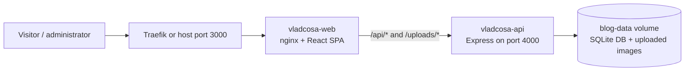

# Vlad Coșa - Cabinet Individual de Psihologie

A minimalist website and blog for a psychology practice, with a React frontend, an Express API, and SQLite persistence.

## Architecture



Only `vladcosa-web` publishes a host port. `vladcosa-api` is reachable exclusively from the private `vladcosa-network` bridge network. Nginx serves the SPA and forwards API and upload requests to the API container.

## Tech Stack

- **Frontend:** React 18, React Router, Vite
- **Styling:** Tailwind CSS, Crimson Pro, Inter
- **Blog rendering:** React Markdown with sanitized HTML output
- **Backend:** Node.js 20, Express
- **Storage:** SQLite through `better-sqlite3`
- **Web server:** nginx Alpine
- **Deployment:** Docker Compose, with Traefik labels and optional AWS Amplify frontend configuration

## Project Structure

```text
vladcosa.ro/
├── src/
│   ├── admin/                 # Lazy-loaded blog administration UI
│   ├── components/            # Shared and landing-page components
│   ├── pages/                 # Public blog and 404 pages
│   ├── LandingPage.jsx        # Main landing page
│   ├── LegalPages.jsx         # Privacy and terms views
│   └── main.jsx               # React entry point and routes
├── server/
│   ├── src/                   # Express API, routes, database, middleware
│   ├── scripts/               # Password-hash helper
│   ├── Dockerfile             # API image
│   └── README.md              # API endpoint reference
├── Dockerfile                 # Frontend build and nginx image
├── docker-compose.yml         # Complete production stack
├── nginx.conf                 # SPA serving and API reverse proxy
└── .env.example               # Frontend and API environment template
```

## Docker Deployment

### 1. Configure the environment

Copy the combined environment template:

```bash
cp .env.example .env
```

Generate the administrator password hash from the API directory:

```bash
cd server
npm ci
npm run hash-password
cd ..
```

Enter the password when prompted, then copy the resulting bcrypt hash into `.env`. Keep it inside single quotes because bcrypt hashes contain `$` characters:

```env
ADMIN_USERNAME=admin
ADMIN_PASSWORD_HASH='$2b$12$...'
SESSION_SECRET=replace-with-a-random-secret-of-at-least-32-characters
NODE_ENV=production
PORT=4000
DB_PATH=/app/data/blog.db
UPLOADS_DIR=/app/data/uploads
```

You can generate a suitable session secret with:

```bash
openssl rand -hex 32
```

The administrator password and session secret are private credentials. Do not commit `.env`.

### 2. Build and start the stack

```bash
docker compose up -d --build
```

The services are:

- `vladcosa-web`: nginx and the built React SPA, available locally at [http://localhost:3000](http://localhost:3000)
- `vladcosa-api`: private Express service on container port 4000
- `blog-data`: persistent volume mounted at `/app/data` in the API container

### 3. Open the administrator

The admin route is intentionally not linked from the public site. After deployment, open:

```text
https://vladcosa.ro/admin
```

Sign in with `ADMIN_USERNAME` and the original password used to generate `ADMIN_PASSWORD_HASH`.

### Health checks

Through nginx, both endpoints should return HTTP 200:

```bash
curl --fail http://localhost:3000/health
curl --fail http://localhost:3000/api/health
```

## Persistent Data and Backups

The Compose-managed `blog-data` volume contains both the SQLite database (`blog.db`) and all uploaded blog images (`uploads/`). Back up the entire volume together and test restores regularly; backing up only the database will leave article cover images behind.

Before copying the volume for a consistent offline backup, stop the stack with `docker compose down` without using `--volumes`. Never run `docker compose down --volumes` unless you explicitly intend to delete all blog data.

## Local Development Without Docker

Start the API:

```bash
cd server
npm ci
cp .env.example .env
npm run hash-password
# Add the generated hash and a session secret to server/.env
npm start
```

In a second terminal, start the Vite frontend:

```bash
npm ci
npm run dev
```

Vite serves the frontend on port 3000 and proxies `/api` and `/uploads` to `http://localhost:4000`.

## Environment Variables

The root `.env.example` is the source template for the complete Docker stack.

| Variable | Purpose |
| --- | --- |
| `VITE_*` | Public site name, contact information, and external URLs embedded at frontend build time |
| `NODE_ENV` | API runtime mode; use `production` in Docker |
| `PORT` | Internal API port; the Compose and nginx configuration expect `4000` |
| `DB_PATH` | SQLite file path; use `/app/data/blog.db` in Docker |
| `UPLOADS_DIR` | Uploaded-image directory; use `/app/data/uploads` in Docker |
| `ADMIN_USERNAME` | Username for the single blog administrator |
| `ADMIN_PASSWORD_HASH` | Bcrypt password hash generated by `npm run hash-password` in `server/` |
| `SESSION_SECRET` | Random value of at least 32 characters used to sign session cookies |

The contact values are public business information. The password hash and session secret must remain private.

## Reverse Proxy

### Traefik

The web service includes Traefik labels for `vladcosa.ro` and `www.vladcosa.ro`. Traefik should share a reachable Docker network with `vladcosa-web` and forward traffic to container port 80.

### Nginx Proxy Manager

When Nginx Proxy Manager runs on the same Docker network, forward to container `vladcosa-psychology` on port 80. When it runs on the host, forward to the host on port 3000. Enable SSL, Force SSL, and HTTP/2.

## Frontend Quality Checks

```bash
npm run lint
npm run build
npm run format:check
```

## Customization

- Edit `tailwind.config.js` to change the sage, cream, and slate palette.
- Edit files under `src/components/` to update landing-page content.
- Fonts are bundled locally through Fontsource imports in `src/main.jsx`.

## Legal Compliance

The full legal name "Coșa Vlad - Cabinet Individual de Psihologie" is displayed in the footer. The privacy policy and terms are templates and must be reviewed by the site owner and a qualified lawyer before publication.

## License

© 2026 Coșa Vlad - Cabinet Individual de Psihologie. All rights reserved.
